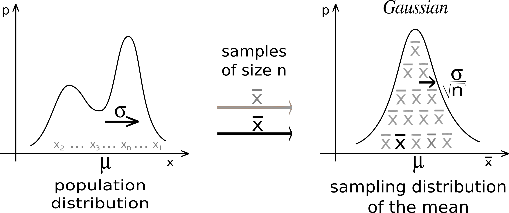
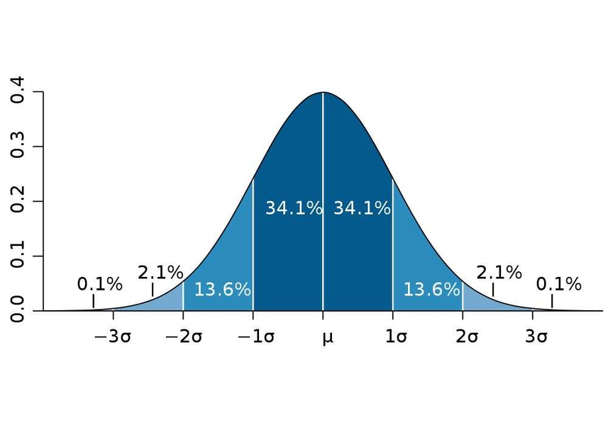

## Saturs

-   Ievads varbūtību teorijā un statistikā
-   Sadalījumi
-   No izlases līdz populācijai
-   Hipotēžu pārbaude

## Varbūtības teorija vs statistika

```{mermaid}
%%| fig-align: center
graph LR
    A[Populācija]
    B[Izlase]
    A -->|varbūtības teorija| B
    B -->|statistika| A
```

. . .

-   Populācija (ģenerālkopa, *population*): nenovērojams
-   Izlase (*sample*): novērojams

. . .

### Notācija un terminoloģija

-   $X$ *gadījuma lielums* (random variable)
-   $x$ *noteiktā vērtība*
-   $X=x$ *notikums*
-   $R(X)$ visu iespējamu gadījuma lieluma vērtību kopa
-   $\Omega$ visu iespējamu eksperimenta rezultātu kopa

## Varbūtības telpas

. . .

> Par varbūtību telpu sauc objektu kolekciju $(\Omega, F, P)$, kur

::: incremental
-   $\Omega$: visu iespējamu rezultātu kopa
-   $F \subseteq 2^\Omega$: izmērāma kopa (measurable set)
-   $P: F \to [0, 1]$: varbūtības mēra funkcija (probability measure)
:::

. . .

### Kolmogorova aksiomas

$$P(\Omega) = 1$$

$$A\cap B = \emptyset \implies P(A\cup B) = P(A) + P(B),\ \ \   \forall A, B \in F$$

. . .

::::: columns
::: {.column width="50%"}
$$ \implies P(A) = 1 - P(A^c)$$
:::

::: {.column width="50%"}
$$\implies  P(\emptyset) = 0$$
:::
:::::

```{=html}
<!---
## 
{width="50%" fig-align=center}
--->
```

# Sadalījumi

## Eksperiments: Motivācija

Kādā no galda spēlēm spēlētājam, kad ir viņam gājiens, vajag met spēles kauliņu. Atkarībā no cik reizes uzmetas $6$, ir dažādas gājiena iespējas. Viena raundā jāmet kauliņš $10$ reizes.

Runā, ka melnā tirgū pirāts nopirka maģisko kauliņu pie raganas. Mums kā spēļu sacensību organizatoriem ir aizdomās, ka pirāta metamais kauliņš uzkrīt uz $6$ biežāk nekā parastais metamais kauliņš.

. . .

**Jautājums:** Ja mums ir dota informācija par katru raundu, vai mēs varam noskaidrot spēles gaitā ar kādu varbūtību tas uzkrīt uz $6$?

. . .

### Apzīmējumi

::: incremental
-   $X$: Skaitlis, ko uzmet, $R(X) = \{1, 2, 3, 4, 5, 6\}$
-   $Y$: Cik reizes uzmeta sešinieku viena raundā, $R(Y) = \{0, 1, \dots, 10\}$
-   $P[X = 6] = ?$
-   $n_1 = 10, n_2 = 100, n_3 = 1000, n_4 = 10000$: raundu skaits vienā spēlē
:::

## Eksperiments: $n_1 = 10$

```{r}
pp = 0.25
hist(rbinom(10, 10, pp), breaks=seq(0, 10, 1), main="10 raundi vienā spēlē", xlab="Cik reizes uzmeta sešinieku viena raundā", ylab="Raundu skaits")
```

## Eksperiments: $n_2 = 100$

```{r}
pirate_100 = rbinom(100, 10, pp)
hist(pirate_100, breaks=seq(0, 10, 1), main="100 raundi vienā spēlē", xlab="Cik reizes uzmeta sešinieku viena raundā", ylab="Raundu skaits")
```

## Eksperiments: $n_3 = 1000$

```{r}
pirate_1000 = rbinom(1000, 10, pp)
hist(pirate_1000, breaks=seq(0, 10, 1), main="1000 raundi vienā spēlē", xlab="Cik reizes uzmeta sešinieku viena raundā", ylab="Raundu skaits")
```

## Eksperiments: $n_4 = 10000$

```{r}
hist(rbinom(10000, 10, pp), breaks=seq(0 , 10, 1), main="10000 raundi vienā spēlē", xlab="Cik reizes uzmeta sešinieku viena raundā", ylab="Raundu skaits")
```

## Kāpēc?

. . .

$$ Y \sim \text{Binom}(10, p) $$

. . .

$$ p = P[X = 6] $$

. . .

> Ja kādu mēģinājumu atkārto $m$ reizes, un katrā atsevišķā reizē notikuma $A$ iestāšanās varbūtība ir vienāda ar $p$, tad saka, ka gadījuma lielums $Y$: «notikuma $A$ iestāšanās reižu skaits» ir sadalīts pēc *binomiāla sadalījuma* likuma $Y \sim \text{Binom}(m, p)$

## Sadalījums

-   Sadalījums: funkcija kas nosaka notikumu iestāšanas varbūtību

```{=html}
<iframe width="900" height="450" src="https://www.math.wm.edu/~leemis/chart/UDR/UDR.html" title="Distribution chart"></iframe>
```

$$\text{Gadījuma lielums} \sim \text{sadalījuma nosaukms}(\text{parametri}) $$ <!-- Mention first-order/second-order functions-->

## Diskrētie un nepārtrauktie sadalījumi

*Diskrētie:* $R(X)$ kopā ir noteiktās, skaitāmas vērtības

. . .

-   $X \sim \text{Bern}(\frac12)$, $X$ - Monēta nolaižas ar ciparu augša
-   $Y \sim \text{Binom}(10, \frac12)$, $Y$ - Cik reizēs no 10 mēģinājumiem monēta nolaižas ar ciparu augšā
-   $Z \sim \text{Geom}(\frac12)$ - Cik mēģinājumus vajag, lai monēta pirmo reizi nolaižas ar ciparu augšā

. . .

*Nepārtrauktie:* $R(X)$ kopa ir intervāls ar neskaitāmi daudz starpvērtībam

. . .

-   $X \sim \text{U}(1, 10)$ - Nejaušs skaitlis intervālā $[1, 10]$
-   $Y \sim \text{Norm}(1.7, 0.3)$ - Augums grupā
-   $Z \sim \text{Exp}(\frac14)$ - Konsultācijas garums veikalā, kad vidējais ir $4$ minūtes

## Diskrētie sadalījumi

::::: columns
::: {.column width="60%"}
$$ X \sim \text{Bern}(p) $$

$$ R(X) = \{0, 1\} $$

*varbūtību masas funkcija*

(probability mass function)

$$p_X(x) :=P[X = x] = \begin{cases} 1-p & \text{ja}\  x=0  \\ p & \text{ja}\  x=1\\\end{cases}$$
:::

::: {.column width="40%"}
```{r, fig.height=6, fig.width=4}
# Bernoulli random variable: X ~ Bernoulli(p)
p <- 0.3
x <- c(0, 1)

# PMF: P(X = x)
pmf <- dbinom(x, size = 1, prob = p)

# Plot PMF
barplot(pmf, names.arg = x, col = "skyblue",
        main = paste("PMF of Bernoulli(p =", p, ")"),
        xlab = "x", ylab = "P(X = x)", ylim = c(0, 1))
grid()
```
:::
:::::

## Diskrētie sadalījumi

::::: columns
::: {.column width="60%"}
$$X \sim \text{Bern}(p)$$ $$R(X) = \{0, 1\}$$ *kumulatīva sadalījuma funkcija*

(cumulative distribution function)

$$
\begin{align}
F_X(x) &:= P[X \le  x] = \sum_{i=0}^x p_X(i)\\
&= 
\begin{cases}
1 - p       & \text{ja } x = 0 \\
1 - p + p   & \text{ja } x = 1 \\
\end{cases}\\
&= 
\begin{cases}
1 - p & \text{ja } x = 0 \\
1     & \text{ja } x = 1 \\
\end{cases}
\end{align}
$$
:::

::: {.column width="40%"}
```{r, fig.height=6, fig.width=4}
# Bernoulli random variable: X ~ Bernoulli(p)
p <- 0.3
x <- c(0, 1)

# CDF: P(X ≤ x)
cdf <- pbinom(x, size = 1, prob = p)

# Plot CDF

barplot(cdf, names.arg = x, col = "red",
        main = paste("CDF of Bernoulli(p =", p, ")"),
        xlab = "x", ylab = "P(X <= x)", ylim = c(0, 1))

grid()

```
:::
:::::

## Nepārtrauktie sadalījumi

```{=html}
<iframe width="900" height="700" src="https://pickerwheel.com/tools/random-number-generator/" title="Wheel Of Fortunet"></iframe>
```

## Nepārtrauktie sadalījumi

$$ P[X=x] = 0 \ \ \ \forall x \in R(X)$$

. . .

~~varbūtības masas funkcija~~ *Varbūtības blīvuma funkcija!*

. . .

$$ f: \mathbb{R} \to \mathbb{R}^{+}_0$$

. . .

```{r}

curve(dgamma(x, shape = 2, rate = 0.5),
      from = 0, to = 20,
      col = "blue", lwd = 2,
      ylab = "Density", main = "Gamma Distribution PDF")
```

## Nepārtrauktie sadalījumi

Kā tad noteikt gadījuma notikuma varbūtību?

. . .

Ar intervālu!

. . .

*kumulatīva sadalījuma funkcija*

> $$F_X(x):= P[X \le x] = \int_{-\infty}^x f(t)\,dt$$

. . .

$$ 
\begin{align}
\implies P[a \le X \le b] &= P[X \le b] - P[X \le a] \\
&= F(b) - F(a) \\
&=  \int_{-\infty}^b f(t)\,dt - \int_{-\infty}^a f(t)\,dt
\end{align}
$$

## Nepārtrauktie sadalījumi

$$ 
\begin{align}
P[a \le X \le b] &= F(b) - F(a) \\
&=  \int_{-\infty}^b f(t)\,dt - \int_{-\infty}^a f(t)\,dt
\end{align}
$$

. . .

> Noteiktā integrāļa īpašība: Intervālu $[\alpha, \beta]$ var sadalīt $[\alpha, \gamma]\cup[\gamma, \beta]$, tad $\int_\alpha^\beta f(t)\,dt = \int_\alpha^\gamma f(t)\,dt + \int_\gamma^\beta f(t)\,dt$

. . .

$$\int_{-\infty}^b f(t)\,dt = \int_{-\infty}^a f(t)\,dt + \int_a^b f(t)\,dt$$

. . .

$$\implies \int_a^b f(t)\,dt = \int_{-\infty}^b f(t)\,dt - \int_{-\infty}^a f(t)\,dt$$

## Nepārtrauktie sadalījumi

::::: columns
::: {.column width="40%"}
> $$ P[a \le X \le b] = \int_a^b f(t)\,dt$$

Piemērs: nepārtraukts vienmērīgs sadalījums

$X \sim U(a, b), b>a$

$$f_X(x) =
\begin{cases}
\frac1{b-a} & \text{ja } \  a \le x \le b\\
0 & \text{citādi}
\end{cases}
$$
:::

::: {.column width="60%"}
```{r, fig.height=6, fig.width=6, fig.align='right'}
curve(dunif(x, min = -1, max = 1),
      from = -2, to = 2,
      ylab = "f_X(x)",
      main = "PDF of Uniform(-1, 1)",
      col = "blue", lwd = 2)
```
:::
:::::

## Nepārtrauktie sadalījumi: vienmērīgs

Piemērs: $X \sim U(a, b)$ Kā atrast kumulatīvo sadalījuma funkciju?

. . .

Trīs gadījumi:

1.  $x < a$
2.  $x \in [a, b]$
3.  $x > b$

. . .

1.  $x < a$

$$F_X(x) = \int_{-\infty}^x f_X(t) \,dt = \int_{-\infty}^x 0 \,dt = 0$$

## Nepārtrauktie sadalījumi: vienmērīgs

$X \sim U(a, b), b>a$

. . .

2.  $x \in [a, b]$ $$
    \begin{align}
    F_X(x) &= \int_{-\infty}^x f_X(t) \,dt = \int_{-\infty}^a f_X(t)\,dt + \int_a^x f_X(t)\,dt \\
    &= \int_{-\infty}^a 0\,dt + \int_a^x \frac1{b-a}\,dt \\
    &= 0 + \frac1{b-a}\int_a^x dt = \left[ \frac{t}{b-a}\right]_a^x = \frac{x-a}{b-a}
    \end{align}
    $$

. . .

## Nepārtrauktie sadalījumi: vienmērīgs

$X \sim U(a, b), b>a$

. . .

3.  $x > b$

$$
\begin{align}
F_X(x) &= \int_{-\infty}^x f_X(t)dt = \int_{-\infty}^a f_X(t)\,dt + \int_{a}^b f_X(t)\,dt + \int_b^x f_X(t)\,dt \\
&= \int_{-\infty}^a 0\,dt + \int_{a}^b \frac1{b-a}\,dt + \int_b^x 0\,dt\\
&= 0 + \left[\frac{t}{b-a}\right]_a^b + 0 = \frac{b}{b-a} - \frac{a}{b-a} \\
&= \frac{b-a}{b-a} = 1
\end{align}
$$

## Nepārtrauktie sadalījumi: vienmērīgs

::::: columns
::: {.column width="40%"}
$$f_X(x) =
\begin{cases}
\frac1{b-a} & \text{ja } \  a \le x \le b\\
0 & \text{citādi}
\end{cases}
$$

$$F_X(x) =
\begin{cases}
0 & \text{ja } \  x <a\\
\frac{x-a}{b-a} & \text{ja } x \in [a, b] \\
1 & \text{ja } \  x > b\\
\end{cases}
$$

> $f_X(x) = \frac{d}{dx} F_X(x)$
:::

::: {.column width="60%"}
```{r, fig.height=4, fig.width=6, fig.align='right'}

# Define range of x values
x_vals <- seq(-2, 2, length.out = 500)

# Compute PDF and CDF values
pdf_vals <- dunif(x_vals, min = -1, max = 1)
cdf_vals <- punif(x_vals, min = -1, max = 1)

# Plot PDF
plot(x_vals, pdf_vals, type = "l", lwd = 2, col = "blue",
     ylim = c(0, 1.1), ylab = "Value", xlab = "x",
     main = "PDF and CDF of Uniform(-1, 1)")

# Add CDF
lines(x_vals, cdf_vals, lwd = 2, col = "darkgreen")

# Add horizontal line for PDF height
abline(h = 0.5, col = "blue", lty = 3)

# Add legend
legend("topleft", legend = c("PDF", "CDF"),
       col = c("blue", "darkgreen"), lwd = 2)

```
:::
:::::

## Nepārtrauktie sadalījumi: vienmērīgs

$$ X \sim U(2, 5), P[3.5 \le X \le4.2]=?$$

::::: columns
::: {.column width="50%"}
$$
\begin{align}
&P[3.5 \le X \le4.2] \\
&= F_X(4.2) - F_X(3.5)\\
&= \frac{4.2-2}{5-2} - \frac{3.5-2}{5-2} \\
&= \frac{2.2 - 1.5}{3}\\
&= \frac{0.7}{3} \approx 23.33\%
\end{align}
$$
:::

::: {.column width="50%"}
```{r, fig.height=5.4, fig.width=6, fig.align='right'}
# Parameters
a <- 2
b <- 5

# X values for full PDF plot
x_vals <- seq(1.5, 5.5, length.out = 500)
pdf_vals <- dunif(x_vals, min = a, max = b)

# Plot PDF with custom y-axis and x-axis ticks
plot(x_vals, pdf_vals, type = "l", lwd = 2, col = "blue",
     ylab = "Density", xlab = "x", main = "PDF of Uniform(2, 5)",
     ylim = c(0, 1), xaxt = "n")

# Add custom x-axis ticks
axis(1, at = seq(1.5, 5.5, by = 0.2))

# Horizontal line for density level
abline(h = 1 / (b - a), col = "blue", lty = 2)

# Define shaded region
x_shade <- seq(3.5, 4.2, length.out = 100)
y_shade <- dunif(x_shade, min = a, max = b)

# Shade the area with sky blue
polygon(c(3.5, x_shade, 4.2), c(0, y_shade, 0),
        col = "skyblue", border = "skyblue4")

# Add vertical dashed lines at bounds of shaded area
abline(v = c(3.5, 4.2), col = "skyblue4", lty = 2)

# Compute and display the probability
prob <- punif(4.2, min = a, max = b) - punif(3.5, min = a, max = b)
text(3.85, 0.4, "P[3.5 ≤ X ≤ 4.2]", col = "darkblue", cex = 1.1)

```
:::
:::::

## Nepārtrauktie sadalījumi

. . .

::::: columns
::: {.column width="50%"}
$$\lim_{x \to -\infty} F_X(x) = 0$$
:::

::: {.column width="50%"}
$$\lim_{x \to \infty} F_X(x) = 1$$
:::
:::::

. . .

Kādi ir kritēriji pmf, pdf un cdf?

. . .

-   $F_X: \Omega = \mathbb{R} \to [0, 1]$ ir ne dilstoša
-   $p_X: \Omega \to [0, 1]$

. . .

::::: columns
::: {.column width="50%"}
$$ \sum_{x \in R(X)} p_X(x) = 1$$
:::

::: {.column width="50%"}
$$ \int_{x \in R(X)} f_X(x)dx = \int_{-\infty}^{\infty} f_X(x)dx = 1 $$
:::
:::::

## Kāpēc matemātiska analīze varbūtību teorijā?

> 1.  Lai strādāt ar nepārtrauktām vērtībām!

<!---------------------------------------------->

# Kas tālāk?

## Sadalījuma momenti

. . .

*Sagaidāma vērtība* (svērtais aritmētiskais vidējais, expected value)

. . .

::::: columns
::: {.column width="50%"}
$$ \mathbb{E}[X] := \sum_{x\in R(X)} x p_X(x) $$
:::

::: {.column width="50%"}
$$ \mathbb{E}[X] :=\int_{-\infty}^{\infty} xf_X(x)dx $$
:::
:::::

. . .

::::: columns
::: {.column width="50%"}
$$ \mathbb{E}[g(X)] := \sum_{x\in R(X)} g(x) p_X(x) $$
:::

::: {.column width="50%"}
$$ \mathbb{E}[g(X)] :=\int_{-\infty}^{\infty} g(x)f_X(x)dx $$
:::
:::::

. . .

Īpašības:

::: incremental
-   $\mathbb{E}[aX + b] = a \mathbb{E}[X] + b$
-   $\mathbb{E}[X+Y] = \mathbb{E}[X] + \mathbb{E}[Y]$
-   $\mathbb{E}[X\cdot Y] = \mathbb{E}[X] \cdot \mathbb{E}[Y]$, ja $X, Y$ ir neatkarīgi
:::

## Sadalījuma momenti

::::: columns
::: {.column width="50%"}
$$ \mathbb{E}[g(X)] := \sum_{x\in R(X)} g(x) p_X(x) $$
:::

::: {.column width="50%"}
$$ \mathbb{E}[g(X)] :=\int_{-\infty}^{\infty} g(x)f_X(x)dx $$
:::
:::::

. . .

*Dispersija* (variance) $$ \text{Var}(X) := \mathbb{E}[\left( X - \mathbb{E}[X]\right)^2] $$

. . .

$$ \implies \text{Var}(X) = \mathbb{E}[X^2] - \mathbb{E}[X]^2$$

. . .

*Standartnovirze* (standard deviation)

$$ \text{SD}(X):= \sqrt{\text{Var}(X)}$$

. . .

Īpašības:

::::: columns
::: {.column width="50%"}
-   $\text{Var}(aX + b) = a^2\text{Var}(X)$
:::

::: {.column width="50%"}
-   $\text{Var}(X \pm Y) = \text{Var}(X) + \text{Var}(Y)$, ja $X, Y$ ir neatkarīgi
:::
:::::

## Sadalījuma momenti: piemērs

> MD: Ja $X\sim U(a, b), b > a$, tad kas ir $\mathbb{E}[X]$, $\text{Var}[X]$?

## Kāpēc matemātiska analīze varbūtību teorijā?

> 1.  Lai strādāt ar nepārtrauktām vērtībām!

. . .

> 2.  Lai varētu veikt secinājumus balstoties uz nepatraukto vērtību teorētisko modeli!

. . .

~~nepatraukto vērtību~~ teorētisko modeli?

## Sadalījuma momenti: piemērs

::::: columns
::: {.column width="40%"}
-   $X \sim \text{Po}(\lambda), \lambda>0$
-   "cik reizes noteiktā intervālā notiks notikums ar vidējo $\lambda$"
-   $R(X) = \mathbb{N}_0 \cup {\infty}$
-   $p_X(x) = \frac{\lambda^x}{x!}e^{-\lambda}$

<!--- Mention meteorites--->
:::

::: {.column width="60%"}
```{r, fig.align='right', fig.width=6, fig.height=6}
# Parameters
lambda <- 3
x_vals <- 0:15

# PMF and CDF
pmf_vals <- dpois(x_vals, lambda = lambda)

# Plot PMF
barplot(pmf_vals, names.arg = x_vals, col = "skyblue",
        main = "Poisson PMF (λ = 3)", ylab = "P(X = x)", xlab = "x")
grid()

```
:::
:::::

## Sadalījuma momenti: piemērs

::::: columns
::: {.column width="40%"}
$$
\begin{align}
\mathbb{E}[X] &= \sum_{x=0}^\infty p_X(x) = \sum_{x=0}^\infty x \frac{\lambda^x}{x!} e^{-\lambda} \\
&= e^{-\lambda} \sum_{x=1}^\infty \frac{\lambda^x}{x!} = e^{-\lambda} \sum_{x=1}^{\infty}\frac{x\cdot\lambda^x}{x\cdot (x-1)!} \\
&= \lambda e^{-\lambda} \sum_{x=1}^\infty \frac{\lambda^{x-1}}{(x-1)!}
\end{align}
$$

> Teilora rinda! $e^x = \sum_{n=0}^\infty \frac{x^n}{n!}$

$$\dots = \lambda e^{-\lambda} \sum_{m=0}^\infty \frac{\lambda^m}{m!} = \lambda e^{-\lambda}e^{\lambda}=\lambda$$
:::

::: {.column width="60%"}
```{r, fig.align='right', fig.width=4, fig.height=6}
# Parameters
lambda <- 3
x_vals <- 0:15

# PMF and CDF
pmf_vals <- dpois(x_vals, lambda = lambda)

# Plot PMF
barplot(pmf_vals, names.arg = x_vals, col = "skyblue",
        main = "Poisson PMF (λ = 3)", ylab = "P(X = x)", xlab = "x")
grid()

```
:::
:::::

## Kāpēc matemātiska analīze varbūtību teorijā?

> 1.  Lai strādāt ar nepārtrauktām vērtībām!

> 2.  Lai varētu veikt secinājumus balstoties uz teorētisko modeli!

# No izlases līdz populācijai

## Statistika

```{mermaid}
%%| fig-align: center
graph LR
    A[Populācija]
    B[Izlase]
    A -->|varbūtības teorija| B
    B -->|statistika| A
```

. . .

-   Populācija (ģenerālkopa, *population*): nenovērojams
-   Izlase (*sample*): novērojams

. . .

```{mermaid}
%%| fig-align: center
graph TD
    A[Statistika]
    B[Aprakstojoša]
    C[Secinošāja]
    A --> B
    A --> C
```

. . .

## Izlases statistika

. . .

*Izlases statistika* (sample statistic) - vērtība, ko var aprēķināt no izlases datiem

. . .

::::: columns
::: {.column width="50%"}
$$  \bar{X} = \frac1n \sum_{i=1}^n X_i$$
:::

::: {.column width="50%"}
$$ S^2 = \frac{1}{n-1} \sum_{i=1}^n (X_i - \bar{X})^2$$
:::
:::::

. . .

Pie dotiem $\{ x_i \}_{i=1}^n$

::::: columns
::: {.column width="50%"}
$$  \bar{x} = \frac1n \sum_{i=1}^n x_i$$
:::

::: {.column width="50%"}
$$ s^2 = \frac{1}{n-1} \sum_{i=1}^n (x_i - \bar{x})^2$$
:::
:::::

## Novērtētājs

. . .

> Kā mēs varam novērtēt kādu lielumu no populācijas?

. . .

### Punkta novērtētāji

$$  \hat{\mu} = \bar{X} = \frac1n \sum_{i=1}^n X_i$$

### Intervālu novērtētāji

$$ \left[ \bar{X} - z_\frac{\alpha}{2} \frac{\sigma}{\sqrt{n}}, \bar{X} + z_\frac{\alpha}{2} \frac{\sigma}{\sqrt{n}} \right]$$

. . .

Intervālu piemērs: ticamības intervāls!

## Intervālu novērtētājs: piemērs

$$X_1, X_2, \dots, X_n \sim \text{Norm}(\mu, \sigma^2)$$

-   $\sigma$ ir zināms

-   $\mu$ ir nezināms

. . .

Mēs gribām uztaisīt intervālu tā, ka $\mu$ ir tajā intervāla ar $1-\alpha$ varbūtību!

## Centrāla robežteorēma

> Ja $$ X_1, X_2, \dots, X_n $$ ir neatkarīgi un ir sadalīts pēc viena sadalījuma, tad $$ \lim_{n\to \infty} \frac1n \sum_{i=1}^n X_i \sim \text{Norm}\left(\mathbb{E}[X], \frac{\text{Var}(X)}{n}\right)  $$

{width="50%" fig-align="center"}

## Normālais sadalījums

::::: columns
::: {.column width="50%"}
$$ X \sim \text{Norm}(\mu, \sigma^2) $$

$$ f_X(x)  = \frac{1}{\sqrt{2\pi \sigma^2}} \, e^{ -\frac{(x - \mu)^2}{2\sigma^2} }$$

$$ \Phi(x) = F_X(x) = \int_{-\infty}^{x} f_X(t) \, dt $$
:::

::: {.column widgth="50%"}
```{r, fig.width=6, fig.height=6 , fig.align='right'}
# Generate values
x_vals <- seq(-4, 4, length.out = 500)
pdf_vals <- dnorm(x_vals)
cdf_vals <- pnorm(x_vals)

# Plot both PDF and CDF
plot(x_vals, pdf_vals, type = "l", lwd = 2, col = "blue",
     ylab = "Value", xlab = "z", main = "N(0, 1)",
     ylim = c(0, 1.1))

lines(x_vals, cdf_vals, lwd = 2, col = "darkgreen")

legend("right", legend = c("PDF", "CDF"),
       col = c("blue", "darkgreen"), lwd = 2)
grid()

```
:::
:::::

## Normālais sadalījums



## Intervālu novērtētājs: piemērs

$$X_1, X_2, \dots, X_n \sim \text{Norm}(\mu, \sigma^2)$$

-   $\sigma$ ir zināms

-   $\mu$ ir nezināms

. . .

Aproksimējam $\bar{X} \sim \text{Norm}\left(\mathbb{E}[X], \frac{\text{Var}(X)}{n}\right) \implies \bar{X} \sim \text{Norm}\left(\mu, \frac{\sigma^2}{n} \right)$

. . .

$$
P[a \le \bar{X} \le b]  = 1 -\alpha
$$

## Intervālu novērtētājs: piemērs

```{r}
# Set significance level
alpha <- 0.07
z_alpha_2 <- qnorm(1 - alpha / 2)

# Create x values
x <- seq(-4, 4, length = 1000)
y <- dnorm(x)

# Plot the standard normal curve
plot(x, y, type = "l", lwd = 2, col = "blue",
     main = "Standarīzētais normālais sadalījums",
     xlab = "x", ylab = "Varbūtības blīvums")

# Define transparent red color (alpha = 0.3 for ~30% opacity)
transparent_red <- rgb(1, 0, 0, alpha = 0.3)

# Shade the critical regions (with transparency)
polygon(c(x[x <= -z_alpha_2], -z_alpha_2),
        c(y[x <= -z_alpha_2], 0), col = transparent_red, border = NA)

polygon(c(x[x >= z_alpha_2], z_alpha_2),
        c(y[x >= z_alpha_2], 0), col = transparent_red, border = NA)

# Add vertical lines for critical values
abline(v = c(-z_alpha_2, z_alpha_2), col = "red", lty = 2)

# Annotate the z_alpha/2 values
text(-z_alpha_2 + 0.2, -0.03, labels = expression(-z[alpha/2]), pos = 3, col = "black")
text(z_alpha_2 - 0.2, -0.03, labels = expression(z[alpha/2]), pos = 3, col = "black")

# Show the alpha/2 regions
text(-2.1, 0.025, labels = expression(alpha/2), col = "red")
text(2.1, 0.025, labels = expression(alpha/2), col = "red")
```

## Intervālu novērtētājs: piemērs

$$X_1, X_2, \dots, X_n \sim \text{Norm}(\mu, \sigma^2)$$

. . .

$$
\begin{align}
&P\left[-z_{\frac{\alpha}{2}} \le \frac{\bar{X} - \mathbb{E}[\bar{X}]}{\sqrt{\text{Var}(\bar{X})}} \le z_{\frac{\alpha}{2}}\right]  
= P\left[-z_{\frac{\alpha}{2}} \le \frac{\bar{X} - \mu}{\frac{\sigma}{\sqrt{n}}} \le z_{\frac{\alpha}{2}}\right]\\
&= P\left[-z_{\frac{\alpha}{2}} \frac{\sigma}{\sqrt{n}} \le \bar{X} - \mu \le z_{\frac{\alpha}{2}} \frac{\sigma}{\sqrt{n}} \right] \\
&= P\left[-z_{\frac{\alpha}{2}} \frac{\sigma}{\sqrt{n}} - \bar{X} \le  - \mu \le z_{\frac{\alpha}{2}} \frac{\sigma}{\sqrt{n}} - \bar{X} \right] \\
&= P\left[\bar{X}  -z_{\frac{\alpha}{2}} \frac{\sigma}{\sqrt{n}} \le   \mu \le \bar{X} + z_{\frac{\alpha}{2}} \frac{\sigma}{\sqrt{n}} \right] = 1 -\alpha
\end{align}
$$

# Hipotēžu pārbaude

## Filozofija

::::: columns
::: {.column width="50%"}
*Frekvenistu pieeja* (frequenist)

-   Varbūtība = ilgtermiņa biežums

-   Ja $6$ dienas līja lietus, tad uz $7$ tas līs $100\%$
:::

::: {.column width="50%"}
*Bejiesa pieeja* (Bayesian)

-   Varbūtība = ticamības mērs

-   Jāskatas pēc mākoņiem
:::
:::::

## Hipotēžu pārbaude

```{r}
# Set significance level
alpha <- 0.07
z_alpha_2 <- qnorm(1 - alpha / 2)

# Create x values
x <- seq(-4, 4, length = 1000)
y <- dnorm(x)

# Plot the standard normal curve
plot(x, y, type = "l", lwd = 2, col = "blue",
     main = "Standarīzētais normālais sadalījums",
     xlab = "x", ylab = "Varbūtības blīvums")

# Define transparent red color (alpha = 0.3 for ~30% opacity)
transparent_red <- rgb(1, 0, 0, alpha = 0.3)

# Shade the critical regions (with transparency)
polygon(c(x[x <= -z_alpha_2], -z_alpha_2),
        c(y[x <= -z_alpha_2], 0), col = transparent_red, border = NA)

polygon(c(x[x >= z_alpha_2], z_alpha_2),
        c(y[x >= z_alpha_2], 0), col = transparent_red, border = NA)

# Add vertical lines for critical values
abline(v = c(-z_alpha_2, z_alpha_2), col = "red", lty = 2)

# Annotate the z_alpha/2 values
text(-z_alpha_2 + 0.2, -0.03, labels = expression(-z[alpha/2]), pos = 3, col = "black")
text(z_alpha_2 - 0.2, -0.03, labels = expression(z[alpha/2]), pos = 3, col = "black")

# Show the alpha/2 regions
text(-2.1, 0.025, labels = expression(alpha/2), col = "red")
text(2.1, 0.025, labels = expression(alpha/2), col = "red")
```

## Hipotēžu pārbaude

-   $H_0$: *bāzes/nulles hipotēze* (nekas nemainas)
-   $H_1$: *alternatīva hipotēze* (to, ko mēs gribām pieradīt)

. . .

Mēs nevaram pierādīt hipotēzi!

. . .

Mēs varām tikai spriest, vai ir izvēlētājam *nozīmes līmenim* (significance level) $\alpha$ ir pietiekami liecību, lai noraidīt/nenoraidīt nulles hipotēzi

. . .

> Mēs nevaram pierādīt, ka visi gulbji ir balti. Mēs varam tikai to noraidīt, atradot vienu melno gulbji.

. . .

::::: columns
::: {.column width="50%"}
*Two-tailed*

$$H_0: \mu = 0 $$

$$H_1: \mu \neq  0 $$
:::

::: {.column width="50%"}
*One-tailed*

$$H_0: \mu = 0 $$

$$H_1: \mu < \text{vai} >  0 $$
:::
:::::

## Hipotēžu pārbaude

-   $H_0$: *bāzes/nulles hipotēze* (nekas nemainās)
-   $H_1$: *alternatīva hipotēze* (to, ko mēs gribām pieradīt)

. . .

Metodoloģija:

1.  Aprēķināt izlases statistikas esošo vērtību varbūtību pēc $H_0$ (*p vērtība*)?
2.  Vai tā varbūtībā ir pietiekami liela? Tad noraidīt vai nenoraidīt nulles hipotēzi!

> Arī saucas Z-test vai T-test!

## Hipotēžu pārbaude: piemērs

::::: columns
::: {.column width="50%"}
```{r}
pirate_100
```
:::

::: {.column width="50%"}
```{r, fig.width=5, fig.height=6, fig.align='right'}
hist(pirate_100, breaks=seq(0, 10, 1), main="1000 raundi vienā spēlē", xlab="Cik reizes uzmeta sešinieku viena raundā", ylab="Raundu skaits")
```
:::
:::::

## Hipotēžu pārbaude: piemērs

$$H_0: p = \frac16 \implies \mu = \mu_0 = 10 \cdot \frac16 = \frac53$$

$$ H_1: p > \frac16 \implies \mu > 10 \cdot \frac16 = \frac53 $$

$$ \alpha = 5\%, \ \ \ n=100$$

. . .

::::: columns
::: {.column width="50%"}
Aproksimējam $t \sim T(n-1)$

$s^2 = \frac{1}{n-1} \sum_{i=1}^n (x_i - \bar{x})^2$

$t = \frac{\bar{x} - \mu_0}{\frac{s}{\sqrt{n}}}$
:::

::: {.column width="50%"}
```{r}
t.test(pirate_100, mu=(5/3), alternative="greater", conf.level = 0.95)
```
:::
:::::

## Kāpēc matemātiska analīze varbūtību teorijā?

> 1.  Lai strādāt ar nepārtrauktām vērtībām!

> 2.  Lai varētu veikt secinājumus balstoties uz teorētisko modeli!

> 3.  Lai varētu aproksimēt un taisit inferences!

# Paldies par uzmanību!
