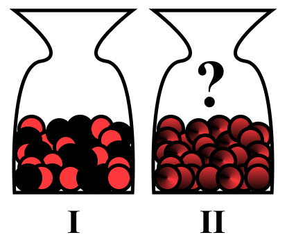

# {.center}

::::{columns}
:::{.column width=50%}
> [Computer science]{style='color: '} is more than just a metaphor for the world of information processing. Its ambition is [all-encompasing]{style='color: '} in aiming to [explain every]{style='color: '} kind of information processing that is possible, [...].

@Valiant2024
:::
:::{.column width="50%"}
](images/leslie_valiant.jpg){style="text-align: right;" fig-align="right"}
:::
::::

# Rationality {.center}

>I - Toss a coin. If it comes up heads you win $100\$$, and if it comes up tails you win nothing.

or

>II - Get 46$ for sure.

@Kahneman2013

## Ellsberg paradox
::::{columns}
:::{.column width=50%}
:::{.center}

{fig-align="center"}

::: {.fragment}

I - [**50 red**]{style='color: red'}, **50 black**

II - [**? red**]{style='color: red'} $+$ **? black** $= 100$

@Ellsberg1961
:::
:::
:::
:::{.column width="50%"}

1. [**Red I**]{style='color: red'}, **Black I** or indifferent? [- Indifferent]{.fragment style='color: '}
2. [**Red II**]{style='color: red'}, **Black II** or indifferent? [- Indifferent]{.fragment style='color: '}
3. [**Red I**]{style='color: red'} or [**Red II**]{style='color: red'}?  [- Red I $\succeq$ Red II]{.fragment style='color: '}
4. **Black I** or **Black II**? [- Black I $\succeq$ Black II]{.fragment style='color: '}

:::{.fragment}

::: {.fragment .highlight-red}

$$
p_{R_I} > p_{R_{II}}
$$

:::

$$
p_{B_I} > p_{B_{II}} 
$$

$$
\iff 1 - p_{R_I} > 1 - p_{R_{II}}
$$

::: {.fragment .highlight-red}

$$
\iff p_{R_{I}} < p_{R_{II}}
$$

:::
:::

:::
::::

## Imprecise Probabilities { transition="fade" auto-animate="true" data-id="ips"}

![Source: [@alan]. A skeleton demonstrating the connection between various uncertainty calculi. $A \to B$ means $A$ generalises $B$, meaning that $B$ is a specific instance of $A$.](./images/diff_methods.png){style="text-align: right;"}

## Imprecise Probabilities {auto-animate="true" data-id="ips"}
:::: {.columns}
::: {.column width="50%"}
![Source: [@alan].](./images/diff_methods.png){style="text-align: left;" fig-align="left"}

:::{.fragment fragment-index=3}
![Source: [@lv]](./images/credal2.png){width="65%" style="text-align: left;" fig-align="left"}
:::
:::
::: {.column width="50%"}
:::{.fragment fragment-index=1 .nonincremental}
[**Credal sets $\mathcal{P}$**]{style='color: '} [@Walley1991]:

- Closed and convex sets of probability distributions $\forall P_1, P_2  \in \mathcal{P}$ $$\{ \lambda P_1 + (1 - \lambda)P_2 \mid \lambda \in [0, 1]\} \subseteq \mathcal P$$
- For finite space, represented as simplex $\Delta^{\lvert \Omega \rvert - 1} := \{ \boldsymbol{\lambda} \in \mathbb{R}^{\lvert \Omega \rvert}_{\ge 0} \mid \sum_{i=1}^{\lvert \Omega \rvert}\lambda_i = 1\}$
:::
:::{.fragment fragment-index=2}
![Source: [@intro_to_ip].](images/credal.png){width="90%" style="text-align: right;" fig-align="right"}
:::
:::
::::

## Imprecise Probabilities {auto-animate="true" data-id="ips"}
:::: {.columns}
::: {.column width="50%"}
![Source: [@alan].](./images/diff_methods.png){style="text-align: left;" fig-align="left"}

:::{.fragment fragment-index=2}
![Source: [@lv]](./images/ihds.png){width="70%" style="text-align: left;" fig-align="left"}
:::
:::
::: {.column width="50%"}
:::{.nonincremental}
[**Credal sets $\mathcal{P}$**]{style='color: '} [@Walley1991]:

- Closed and convex sets of probability distributions
:::
:::{.fragment fragment-index=1}
[**Lower/upper probabilities**]{style='color: '}

$$
\bar{\mathbb{P}} \left[ A\right] = \sup_{P \in \mathcal{P}} P(A)
$$
$$
\underline{\mathbb{P}} \left[ A\right] = \inf_{P \in \mathcal{P}} P(A)
$$
$\forall A \in \sigma(\Omega)$ [@ihds]
:::
:::
::::

## Imprecise Probabilities {auto-animate="true" data-id="ips"}

:::: {.columns}
::: {.column width="50%"}
![Source: [@alan].](./images/diff_methods.png){style="text-align: left;" fig-align="left"}

:::{.fragment .nonincremental}
Based on @kolmogorov1950:

- $(\mathcal{\Omega}, \sigma(\mathcal{\Omega}), \mathbb{P})$ is a [**probability space**]{style='color: '}
  i. $\mathbb{P}[A] \ge 0 \quad \forall A \in \sigma(\mathcal{\Omega})$
  ii. $\mathbb{P}[\mathcal{\Omega}] = 1$
  iii. $\mathbb{P}\left[ \bigcup_{i=1}^\infty   A_i  \right] = \sum_{i=1}^\infty \mathbb{P}[A_i]$ where $A_i \in \sigma(\Omega)$ are disjoint
:::

:::
::: {.column width="50%"}
@Choquet1954:

:::{.nonincremental}

- Let $(\mathcal{\Omega}, \sigma(\mathcal{\Omega}))$ be a measurable space ($\mathcal{\Omega} \neq \emptyset$)

- Set function $\nu: \sigma(\mathcal{\Omega}) \to [0,1]$ is a [**(Choquet) capacity**]{style='color: '} iff:
  i. $\nu(\emptyset) = 0$ 
  ii. $\nu(\mathcal{\Omega}) = 1$
  iii. $\forall A, B \in \sigma(\mathcal{\Omega}), A\subseteq B$ $\implies \nu(A) \le \nu(B)$
:::

:::{.fragment style='color: '}
$$
\begin{align*}
&1 = \mathbb{P}[\mathcal{\Omega}] = \mathbb{P}[\emptyset] + \mathbb{P}[\emptyset^C] \\
&\implies \mathbb{P}[\emptyset] = 0 \\
&\mathbb{P}[B]= \mathbb{P}[(B\setminus A) \cup A] \\ 
&= \mathbb{P}[B\setminus A] + \mathbb{P}[A]
\end{align*}
$$

:::

:::
::::

## Imprecise Probabilities: DST

:::: {.columns}
::: {.column width="50%"  style='color: '}

![Source: [@alan].](./images/diff_methods.png){style="text-align: left;" fig-align="left"}

:::{.nonincremental}

- Set function $\nu: \sigma(\mathcal{\Omega}) \to [0,1]$ is a **(Choquet) capacity** iff:
  i. $\nu(\emptyset) = 0$ 
  ii. $\nu(\mathcal{\Omega}) = 1$
  iii. $\forall A, B \in \sigma(\mathcal{\Omega}), A\subseteq B$ $\implies \nu(A) \le \nu(B)$

:::
:::
::: {.column width="50%" }
@Dempster1967 and @Shafer1976

:::{.nonincremental}
- $m: 2^\Omega \to [0, 1]$
- $m (\emptyset) = 0$ and $\sum_{A \in 2^\Omega} m(A) = 1$
:::

- $\text{Bel}(A) = \sum_{B\subseteq A} m(B)$ [$=\underline{P}$]{.fragment style='color: '}
- $\text{Pl}(A) = \sum_{B\cap A \neq \emptyset} m(B)$ [$=\bar{P}$]{.fragment style='color: '}
- $\text{Bel}(A) \le \text{Pl}(A)$

:::{.fragment style='color: '}
$$\text{Pl}(A) = 1 - \text{Bel}(A^C)$$
:::

:::{.fragment style='color: '}

**2-monotonicity:** $\forall A_1, A_2 \in 2^\Omega$
$$
\begin{align*}
\nu(A_1 \cup A_2) \ge \nu(A_1) &+ \nu(A_2) \\
& - \nu(A_1 \cap A_2)
\end{align*}
$$

:::
:::
::::

## Imprecise Probabilities: DST

:::: {.columns}
::: {.column width="50%"}

::: {.fragment .nonincremental}
- [**Red I**]{style='color: red'}, **Black I** or indifferent? [- Indifferent]{style='color: '}
- [**Red II**]{style='color: red'}, **Black II** or indifferent? [- Indifferent]{style='color: '} 
- [**Red I**]{style='color: red'} or [**Red II**]{style='color: red'}?  [- Red I $\succeq$ Red II]{style='color: '}
- **Black I** or **Black II**? [- Black I $\succeq$ Black II]{style='color: '}
:::

:::{.nonincremental style='color: '}
- $m: 2^\Omega \to [0, 1]$
- $m (\emptyset) = 0$ and $\sum_{A \in 2^\Omega} m(A) = 1$
- $\text{Bel}(A) = \sum_{B\subseteq A} m(B) =\underline{P}$
- $\text{Pl}(A) = \sum_{B\cap A \neq \emptyset} m(B) =\bar{P}$
- $\text{Bel}(A) \le \text{Pl}(A)$
- $\text{Pl}(A) = 1 - \text{Bel}(A^C)$
:::
:::
::: {.column width="50%"}

[$$m_I(\{R\}) = m_I(\{B\}) = 0.5$$]{.fragment style='color: '}

[$$m_{II}(\{ R, B\}) = 1.0$$]{.fragment style='color: '}

:::{.fragment}

| Bet | Mass | Bel | Pl |
|---------|:-----:|:------:|:------:|
| [**Red I**]{style='color: red'}    | $0.5$   |    [$\boldsymbol{0.5}$]{style='color: '} |     $0.5$ | 
| **Black I**     | $0.5$  |  $0.5$ |     $0.5$ | 
| [**RI**]{style='color: red'} or **BI** | $0.0$ | $1.0$ |    $1.0$| 
|||||
| [**Red II**]{style='color: red'}    | $0.0$   | [$\boldsymbol{0.0}$]{style='color: '}   |     $1.0$ |
| **Black II**      | $0.0$  |$0.0$ |    $1.0$ |
| [**RII**]{style='color: red'} or **BII** | $1.0$ |$1.0$ |    $1.0$ | 
:::
:::
::::

## Uncertainty decomposition
::::{.columns}
::: {.column width="50%" style="text-align: center;"}

[**aleatoric**]{style='color: '}

(irreducible, conflict)

:::
::: {.column width="50%" style="text-align: center;"}

[**epistemic**]{style='color: '}

(reducible, non-specifity)

:::
::::

![Source: [@cats_uncertainty]](./images/cats.png){.fragment style="text-align: right;"}

:::: {.columns}
::: {.column width="50%" .fragment}

[**total**]{style='color: '}

[$TU(\mathcal{P})  = AU(\mathcal{P}) + EU(\mathcal{P})$]{style='color: '}

:::
:::{.column width="30%" style="text-align: right;"}

{width="20%" .fragment fig-align="right"}
:::
::::

## Uncertainty decomposition

![Source: [@Waegeman]. Sources of epistemic uncertainty in deep learning.](./images/epistemic.png){fig-align="center" style="text-align: right;"}

## Uncertainty decomposition

- Shannon entropy [@Shannon1948]: $H(P) = - \mathbb{E}_P \left[ \log_2 P(X)\right]$
- [**Lower**]{style='color: '} and [**upper**]{style='color: '} Shannon entropies [@Abelln2006]: $$\underline{H}(\mathcal{P}) = \inf_{P \in \mathcal{P}} H(P)$$ $$\bar{H}(\mathcal{P}) = \sup_{P \in \mathcal{P}} H(P)$$

:::{.fragment style='color: '}
$$ TU(\mathcal{P})  = AU(\mathcal{P}) + EU(\mathcal{P})$$

$$ \bar{H}(\mathcal{P}) = \underline{H}(\mathcal{P})  + (\bar{H}(\mathcal{P}) - \underline{H}(\mathcal{P}))$$
:::

## Uncertainty decomposition

![Source: [@Hllermeier2021]](./images/methods.png){style="text-align: right;"}

# Imprecise Probabilistic ML

## Conformal Prediction (CP) {auto-animate="true" data-id="CP"}

::: {.fragment .nonincremental}
- Introduced by @VladimirVovk2005
- $\mathcal{D}_\text{cal} = \{ (X_1, Y_1), (X_2, Y_2), \dots, (X_n, Y_n) \} \subseteq \mathcal{X} \times \mathcal{Y}$
- **Key assumption:** $\mathcal{D}_\text{cal} \cup (X_{n+1}, Y_{n+1})$ is **exchangeable**
:::
::: {.fragment .nonincremental}
- $s: \mathcal{X} \times \mathcal{Y} \to [0, 1]$ - (non)conformity function
- $\alpha$ - user specified coverage level
- Form a prediction set $\mathcal{C}(X_{n+1}) = \{y \in \mathcal{Y} : s(X_{n+1}, y) \ge \tau \}$ where $\tau = q(\{s(x, y) \mid (x, y) \in \mathcal{D}_\text{cal}\}, \alpha)$
:::

## Conformal Prediction (CP) {transition="fade" auto-animate="true" data-id="CP"}

::: {.nonincremental}
- Form a prediction set $\mathcal{C}(X_{n+1}) = \{y \in \mathcal{Y} : s(X_{n+1}, y) \ge \tau \}$ where $\tau = q(\{s(x, y) \mid (x, y) \in \mathcal{D}_\text{cal}\}, \alpha)$
:::

![Source: [@lv]. Example of conformal prediction at significance level $\alpha = 0.05$ applied to a logistic regression classifier with three classes. The model’s predicted label is \textit{Class 1}, but the conformal predictor yields a prediction set $C(x_{\text{new}}) = \{\text{Class 1}, \text{Class 2}\}$.](images/CP_demo.png){style="text-align: right;"}

## Conformal Prediction (CP) {auto-animate="true" data-id="CP"}
> **Statistical guarantee**: 
[$$\mathbb{P}\left[ Y_{n+1} \in \mathcal{C}\left(X_{n+1}\right) \right] \ge 1-\alpha$$]{style='color: '}

![Source: [@lv]. Example of conformal prediction at significance level $\alpha = 0.05$ applied to a logistic regression classifier with three classes. The model’s predicted label is \textit{Class 1}, but the conformal predictor yields a prediction set $C(x_{\text{new}}) = \{\text{Class 1}, \text{Class 2}\}$.](images/CP_demo.png){style="text-align: right;"}

## Application: medical imaging
![Source: [@dataset_ex]. Raw expert annotations (left) vs. the final goldstandard ground truth (right) on a sample image from CytoCrowd.](images/datasetshow.png){style="text-align: right;"}

## Imprecise Probabilistic CP

::: {.nonincremental}
- @caprio2025
- $\mathcal{D}_\text{cal} = \{ (X_1,  \boldsymbol{\Lambda_1}), (X_2, \boldsymbol{\Lambda_2}), \dots, (X_n, \boldsymbol{\Lambda_n}) \} \subseteq \mathcal{X} \times \Delta^{K-1}$
- $\implies \mathcal{C}(X_{n+1}) = \{ \lambda \in \Delta^{K-1}:S(X_{n+1}, \lambda) \ge \tau \}$ plausibility region
:::
:::{.fragment .nonincremental}
- $S(x, \boldsymbol{\lambda}) = \sum_{i=1}^K \lambda_i s(x, k_i)$
- $\mathcal{P} = \{\text{Cat}(\lambda) : \lambda \in \mathcal{C}(X_{n+1}) \}$ credal region
:::
:::{.fragment .nonincremental}
>Statistical guarantee: [$$\mathbb{P}\left[  \text{Cat}\left(\Lambda_{n+1}\right) \in \mathcal{P}\right] \ge 1-\alpha$$]{style='color: '}
:::

## Key takeaways

- Probability theory and statistics are an [incredibly]{style='color: '} interesting phenomena
- [**WEWTYIW**]{style='color: '} principle - "Why Everything We Teach You Is Wrong"
- Kolmogorovian axiomatisation is actually [not enough]{style='color: '} when reasoning about uncertainty $\implies$ we need new models (IPs)
- Uncertainty can be [aleatoric]{style='color: '} and [epistemic]{style='color: '}
- Conformal Prediction is actually [magical ~~black~~ box]{style='color: '}
- We need to teach AI about uncertainty

## References {.smaller .scrollable}

::: {#refs}
:::

# 
::::{.columns style="display: flex; align-items: center;"}
:::{.column width="50%"}
::: {.center}
[**Thank you for attention!**]{style='color: '}

Any questions?
:::
:::
:::{.column width="50%"}
{fig-align="right"}
{fig-align="right"}
:::
::::
