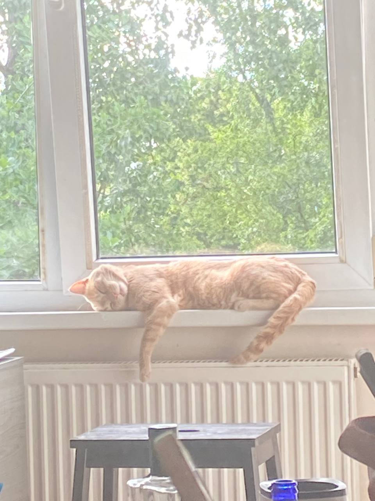
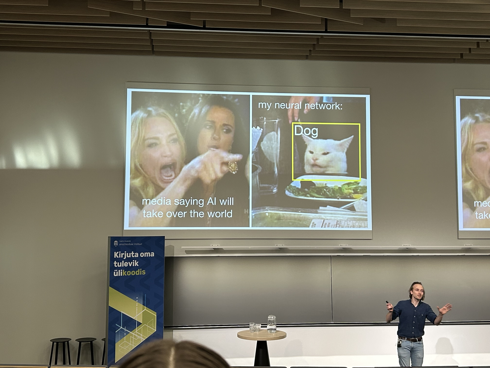

# Plan

:::{.fragment .larger style='color: '}
1. **Why mind? Why dice? [(Rationale)]{style='color: '}**
2. **IPs are nice [(Toolbox)]{style='color: '}**
3. **What we can do with it? [(Application to ML)]{style='color: '}**
:::

<!---

# Rationale

](/images/imitation.png)

::: {.fragment style='color: '}
$$ (\text{Imitation Game})^{-1}: \text{Human} \to \text{Agent} $$
:::

## Cat vs Dog

::::{.columns}
:::{.column width="50%"}
{width="70%"  fig-align="center"}
:::
:::{.column width="50%"}
{width="70%" fig-align="center"}
:::
::::
--->

## Cat vs Dog 

::: {.r-stack}
::: {.fragment}
![Source: [@cats_uncertainty]](./images/cats.png){style="text-align: center;"}

::::{.columns .fragment}
::: {.column width="50%" style="text-align: center;"}

[**aleatoric**]{style='color: '}

(irreducible, conflict)

:::
::: {.column width="50%" style="text-align: center;"}

[**epistemic**]{style='color: '}

(reducible, non-specifity)

:::
::::
:::: {.columns}
::: {.column width="50%" .fragment}

[**total**]{style='color: '}

[$TU  = AU + EU$]{style='color: '}

:::
:::{.column width="30%" style="text-align: right;"}

{width="20%" .fragment fig-align="right"}
:::
::::
::: 

](./images/tom_shrug.jpg){.fragment style="text-align: center;"}

:::

## Classical probabilities

::::{.columns}
::: {.column width="50%"}
$$ 
\begin{align}
\text{Var}(\hat{y} \mid x) &= \mathbb{E}_\theta\!\left[ \text{Var}(\hat{y} \mid x, \theta)  \right] \\
&+ \text{Var}_\theta(\mathbb{E}_\theta\!\left[\hat{y} \mid x, \theta  \right])
\end{align}
$$
[@Waegeman]
:::
::: {.column width="50%" .fragment}
![Ellsberg paradox [@Ellsberg1961]](images/ellsberg_paradox.png){width="60%" style="text-align: right;" style="text-align: center;"}
:::
::::

:::{.fragment}
> If I do not know anything about event $A$, I want to encode $\mathbb{P}[A] = 0$, but that implies that I know everything about $A^C$ since now  $\mathbb{P}[A^C]= 1$ [@alan].
:::

# Toolbox

## Imprecise Probabilities

![Source: [@alan]. A skeleton demonstrating the connection between various uncertainty calculi. $A \to B$ means $A$ generalises $B$, meaning that $B$ is a specific instance of $A$.](./images/diff_methods.png){.fragment}

## Credal sets

:::: {.columns}

::: {.column width="50%"}
:::{.fragment fragment-index=1 .nonincremental}
[**Credal sets $\mathcal{P}$**]{style='color: '} [@Walley1991]:

- Closed and convex sets of probability distributions $\forall P_1, P_2  \in \mathcal{P}$ $$\{ \lambda P_1 + (1 - \lambda)P_2 \mid \lambda \in [0, 1]\} \subseteq \mathcal P$$
- For finite space, represented as simplex $\Delta^{\lvert \Omega \rvert - 1} := \{ \boldsymbol{v} \in \mathbb{R}^{\lvert \Omega \rvert}_{\ge 0} \mid \sum_{i=1}^{\lvert \Omega \rvert}v_i = 1\}$
:::
:::{.fragment fragment-index=2 style='color: '}
$$x+y+z = 1$$
:::
:::
::: {.column width="50%"}

:::{.fragment fragment-index=3}
![Source: [@lv]](./images/credal2.png){width="50%" style="text-align: right;" fig-align="center"}
:::
:::{.fragment fragment-index=4}
![Source: [@intro_to_ip].](images/credal.png){width="70%" style="text-align: right;" fig-align="center"}
:::
:::
::::

## Lower and upper probabilities

:::: {.columns}
::: {.column width="50%"}
:::{.nonincremental style='color: '}
**Credal sets $\mathcal{P}$** [@Walley1991]:

- Closed and convex sets of probability distributions
:::

:::{.fragment fragment-index=2}
![Source: [@lv]](./images/ihds.png){width="70%" style="text-align: left;" fig-align="left"}
:::
:::
::: {.column width="50%"}

:::{.fragment fragment-index=1}
[**Lower/upper probabilities**]{style='color: '}

$$
\bar{\mathbb{P}} \left[ A\right] = \sup_{P \in \mathcal{P}} P(A)
$$
$$
\underline{\mathbb{P}} \left[ A\right] = \inf_{P \in \mathcal{P}} P(A)
$$
$\forall A \in \sigma(\Omega)$ [@ihds]
:::
:::
::::

## Uncertainty decomposition

- Shannon entropy [@Shannon1948]: $H(P) = - \mathbb{E}_P \left[ \log_2 P(X)\right]$
- [**Lower**]{style='color: '} and [**upper**]{style='color: '} Shannon entropies [@Abelln2006]: $$\underline{H}(\mathcal{P}) = \inf_{P \in \mathcal{P}} H(P)$$ $$\bar{H}(\mathcal{P}) = \sup_{P \in \mathcal{P}} H(P)$$

:::{.fragment style='color: '}
$$ TU(\mathcal{P})  = AU(\mathcal{P}) + EU(\mathcal{P})$$

$$ \bar{H}(\mathcal{P}) = \underline{H}(\mathcal{P})  + (\bar{H}(\mathcal{P}) - \underline{H}(\mathcal{P}))$$
:::

## Progress check

- [x] We know how to create our abstract model [- Credal sets]{style='color: ' .fragment}
- [x] We know how to draw inference on the credal set [- Lower and upper probabilities]{style='color: ' .fragment}
- [x] We know how it relates to uncertainty decomposition [- Lower and upper Shannon entropies]{style='color: ' .fragment}

](./images/wat.jpg){.fragment style="text-align: center;" width="35%"}

## Conformal Prediction (CP) {auto-animate="true" data-id="CP"}

::: {.fragment .nonincremental}
- Introduced by @VladimirVovk2005
- $\mathcal{D}_\text{cal} = \{ (X_1, Y_1), (X_2, Y_2), \dots, (X_n, Y_n) \} \subseteq \mathcal{X} \times \mathcal{Y}$
- **Key assumption:** $\mathcal{D}_\text{cal} \cup (X_{n+1}, Y_{n+1})$ is **exchangeable**
:::
::: {.fragment .nonincremental}
- $s: \mathcal{X} \times \mathcal{Y} \to [0, 1]$ - (non)conformity function
- $\alpha$ - user specified miscoverage level
- Form a prediction set $\mathcal{C}(X_{n+1}) = \{y \in \mathcal{Y} : s(X_{n+1}, y) \ge \tau \}$ where $\tau = q(\{s(x, y) \mid (x, y) \in \mathcal{D}_\text{cal}\}, \alpha)$
:::

## Conformal Prediction (CP) {transition="fade" auto-animate="true" data-id="CP"}

::: {.nonincremental}
- Form a prediction set $\mathcal{C}(X_{n+1}) = \{y \in \mathcal{Y} : s(X_{n+1}, y) \ge \tau \}$ where $\tau = q(\{s(x, y) \mid (x, y) \in \mathcal{D}_\text{cal}\}, \alpha)$
:::

![Source: [@lv]. Example of conformal prediction at significance level $\alpha = 0.05$ applied to a logistic regression classifier with three classes. The model’s predicted label is *Class 1*, but the conformal predictor yields a prediction set $C(x_{\text{new}}) = \{\text{Class 1}, \text{Class 2}\}$.](images/CP_demo.png){style="text-align: right;"}

## Conformal Prediction (CP) {auto-animate="true" data-id="CP"}

> **Statistical guarantee**: 
[$$\mathbb{P}\left[ Y_{n+1} \in \mathcal{C}\left(X_{n+1}\right) \right] \ge 1-\alpha$$]{style='color: '}

![Source: [@lv]. Example of conformal prediction at significance level $\alpha = 0.05$ applied to a logistic regression classifier with three classes. The model’s predicted label is *Class 1*, but the conformal predictor yields a prediction set $C(x_{\text{new}}) = \{\text{Class 1}, \text{Class 2}\}$.](images/CP_demo.png){style="text-align: right;"}

# Imprecise Probabilistic ML

## Application: medical imaging

![Source: [@dataset_ex]. Raw expert annotations (left) vs. the final goldstandard ground truth (right) on a sample image from CytoCrowd.](images/datasetshow.png){style="text-align: right;"}

## Imprecise Probabilistic CP

::: {.nonincremental}
- @caprio2025
- $\mathcal{D}_\text{cal} = \{ (X_1,  \boldsymbol{\Lambda_1}), (X_2, \boldsymbol{\Lambda_2}), \dots, (X_n, \boldsymbol{\Lambda_n}) \} \subseteq \mathcal{X} \times \Delta^{K-1}$
- $\implies \mathcal{C}(X_{n+1}) = \{ \lambda \in \Delta^{K-1}:S(X_{n+1}, \lambda) \ge \tau \}$ plausibility region
:::
:::{.fragment .nonincremental}
- $S(x, \boldsymbol{\lambda}) = \sum_{i=1}^K \lambda_i s(x, k_i)$
- $\mathcal{P} = \{\text{Cat}(\lambda) : \lambda \in \mathcal{C}(X_{n+1}) \}$ credal region
:::
:::{.fragment .nonincremental}
>Statistical guarantee: [$$\mathbb{P}\left[  \text{Cat}\left(\Lambda_{n+1}\right) \in \mathcal{P}\right] \ge 1-\alpha$$]{style='color: '}
:::

# Key takeaways

- Probability theory and statistics are [incredibly]{style='color: '} interesting phenomena
- [**WEWTYIW**]{style='color: '} principle - "Why Everything We Teach You Is Wrong"
- Kolmogorovian axiomatisation is actually [not enough]{style='color: '} when reasoning about uncertainty $\implies$ we need new models (IPs)
- Uncertainty can be [aleatoric]{style='color: '} and [epistemic]{style='color: '}
- Conformal Prediction is actually [magical ~~black~~ box]{style='color: '}
- We need to teach AI about uncertainty

:::{.fragment}

  

    <a href="https://tenor.com/view/like-gif-9303086736446991732">Like GIF</a> from <a href="https://tenor.com/search/like-gifs">Like GIFs</a>
  

:::

## References {.smaller .scrollable}

::: {#refs}
:::

# 
::::{.columns style="display: flex; align-items: center;"}
:::{.column width="50%"}
::: {.center}
[**Thank you for attention!**]{style='color: '}

Any questions?

:::
:::
:::{.column width="50%"}
{fig-align="right"}
{fig-align="right"}
:::
::::
